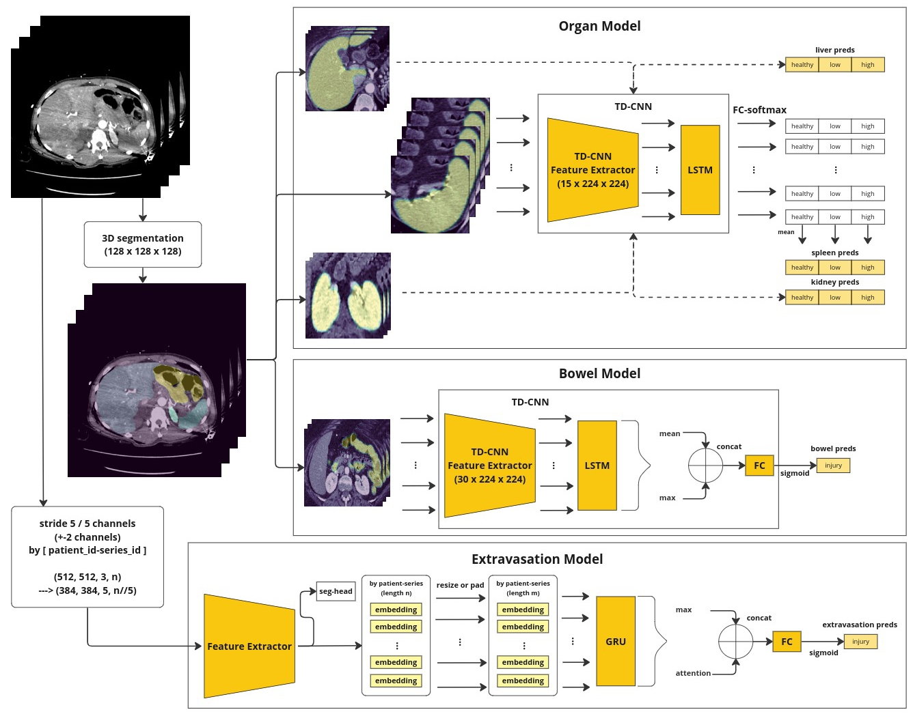

# 6th Place Solution : RSNA 2023 Abdominal Trauma Detection Competition
[RSNA 2023 Abdominal Trauma Detection Competition](https://www.kaggle.com/competitions/rsna-2023-abdominal-trauma-detection/overview)  

---

## Introduction  

Team: [Sushi Master](https://www.kaggle.com/madquer)  
Rank: `6/1123` Solo Winner - [LeaderBoard](https://www.kaggle.com/competitions/rsna-2023-abdominal-trauma-detection/leaderboard)  


[Solution Summary](https://www.kaggle.com/competitions/rsna-2023-abdominal-trauma-detection/discussion/448208)  

Hardware:   
* CPU : `AMD RYZEN 3700X 8 cores 16 threads`  
* memory : `32GB`  
* GPU : `NVIDIA RTX 3090 GPU with 24 GB VRAM`  
* number of GPUs : `1`  

OS/platform : `Ubuntu 20.04`   

---
## Solution Summary
This repository contains code to reproduce the 6th place solution, achieving private LB 0.40.




---

## Prerequisites

* Clone the repository
* Setup the environment:  
    `pip install -r requirements.txt`

* Download the data in the `data` folder:
    * download [Competition data](https://www.kaggle.com/competitions/rsna-2023-abdominal-trauma-detection/data) and change folder name to `dataset`
        
        ```
        data/dataset
        ├── dataset_structure.txt
        ├── image_level_labels.csv
        ├── sample_submission.csv
        ├── segmentations [206 entries exceeds filelimit, not opening dir]
        ├── test_dicom_tags.parquet
        ├── test_images
        ├── test_series_meta.csv
        ├── train.csv
        ├── train_dicom_tags.parquet
        ├── train_images
        └── train_series_meta.csv
        ```
    
    * run bash file to make custom dataframe to run code (below)
    * (recommend) download [custom bbox dataframe](https://www.kaggle.com/datasets/vaillant/rsna-abdominal-trauma-extravasation-bounding-boxes) made by [Ian Pan](https://www.kaggle.com/competitions/rsna-2023-abdominal-trauma-detection/discussion/441402) for train the extravasation model with better performance
    * download premade dataframe and folder structure <[link](https://www.kaggle.com/datasets/madquer/rsna-abdominal-dataset-structure/data)> to save time 

* (recommend) Download the trained model  
    * [Single Model](https://www.kaggle.com/datasets/madquer/rsna-models) (recommend for testing quickly)
    * [Ensemble Model](https://www.kaggle.com/datasets/madquer/rsna-2023-abdominal-6th-place-model)  

---

## Run The pipeline  

### Make custom dataframe (requirement)
1. Download Competition data (above)
2. `cd bash` : to run bash file
3. `source prepare_data_dicom.sh` : convert dicom files to png
4. `source prepare_dataframe.sh` : generate dataframes to run code

Structure should be :
```
data
├── active_extravasation_bounding_boxes.csv     # download custom bbox dataframe (above)
├── dataset                                     # download competition dataset
├── png_folder                                  # generated by dicom-png-conversion.py
├── seg_df.csv                                  # [1/6] by df_seg.py
├── df_seg.csv                                  # [1/6] by df_seg.py
├── train_df.csv                                # [2/6] by train_df.py
├── d.pkl                                       # [3/6] by generate_png_files_dict.py
├── dcm_number.csv                              # [4/6] by dcm_number.py
├── inverse.csv                                 # [5/6] generated by inverse.py
├── extra_sliding_5_bbox.csv                    # [6/6] by extra_bbox.py
├── extra_sliding_5_bbox_pos.csv                # [6/6] by extra_bbox.py
└── extra_mask                                  # [6/6] by extra_bbox.py
```

### Train model
`cd bash` : to run bash file

#### 1. Train 3D segmentation model
1. `source seg_save_cache.sh` : save transformed images and masks to train segmentation model to save time  
2. `source seg.sh` : to train segmentation model
3. `source seg_output.sh` : save segment and crop images to train organ and bowel model  
    * segmentation model folder  
        ```
        ├── results
        │   ├── segmentations
        │   │   └── test
        ```
    * data structure of segmented output will be :
        ```
        ├── segmentations           # by seg_save_cache.sh
        │   └── s_128
        ├── segmented               # by seg_output.sh
        │   ├── bowel
        │   ├── bowel_slices
        │   ├── left_kidney
        │   ├── liver
        │   ├── right_kidney
        │   └── spleen
        ```

#### 2. Train Organ and Bowel Model
1. `source train_organ_bowel.sh` : to train organ and bowel model

#### 3. Train Extravasation Model
* with bbox custom dataset
    1. `source train_extra_seg_cls.sh` : to train feature extractor
    2. `source get_extra_embedding_seg.sh` : to get feature embeddings
        * extravasation feature extractor model folder  
            ```
            ├── results
            │   ├── stage2-extra-type1-seg
            │   │   └── extra-feat-sliding-seg
            ```
        * data structure of feature embedding output will be :
            ```
            data
            ├── feature_extracted                           
            │   └── sliding_5             # saved feature embeddings
            ```
    3. `source train_extra_seg_seq.sh` : to train sequence model

* w/o bbox custom dataset
    1. `source train_extra_cls.sh` : to train feature extractor
    2. `source get_extra_embedding.sh` : to get feature embeddings
        * extravasation feature extractor model folder  
            ```
            ├── results
            │   ├── stage2-extra-type1
            │   │   └── extra-feat-sliding
            ```
        * data structure of feature embedding output will be :
            ```
            data
            ├── feature_extracted                           
            │   └── sliding_5_no_seg            # saved feature embeddings
            ```
    3. `source train_extra_seq.sh` : to train sequence model

#### check Cross-Validation score

* results directory
    ```
    ├── results
    │   ├── segmentations
    │   │   └── test
    │   ├── stage2-bowel-type1
    │   │   └── bowel
    │   ├── stage2-extra-type1-seg
    │   │   ├── extra-feat-sliding-seg
    │   │   ├── extra-feat-sliding-seg-seq
    │   └── stage2-organ-type1
    │       └── organ
    ```

* evaluation

    If you train model and all models are saved correctly, or [download my models](https://www.kaggle.com/datasets/madquer/rsna-models/data) same as above results directory, run command as below directly.    
    If not, check variable of path of model folder in code.  

    1. `cd src`
    2. `python stage2-organ-type1.py --run_type valid` # evaluate organ
    3. `python stage2-bowel-type1.py --run_type valid` # evaluate bowel
    4. `python stage2-extra-type1-sequence-type2-mask.py --run_type valid` # evaluate extravasation

    * .csv files will be saved 
        ```
        results
        ├── segmentations
        │   └── test
        │       ├── logs
        │       └── model
        ├── stage2-bowel-type1
        │   └── bowel
        │       └── bowel_valid.csv
        ├── stage2-extra-type1-seg
        │   ├── extra-feat-sliding-seg
        │   │   ├── logs
        │   │   └── model
        │   └── extra-feat-sliding-seg-seq
        │       ├── extra_valid.csv
        │       ├── logs
        │       └── model
        └── stage2-organ-type1
            └── organ
                └── organ_valid.csv
        ```

* check score
    1. `cd notebooks/check_cv`  
    2. run notebook `prepare_cv.ipynb`
    3. run notebook `check_cv.ipynb`


Scores:  
* Public 0.42 - Private 0.40
    * (Effv2s) Organ
    * (Effv2s) Bowel
    * (SeResNeXt50_32x4d) Extravasation  
* Public 0.42 - Private 0.40
    * (Effv2s + SeResNeXt50_32x4d) Organ
    * (Effv2s + SeResNeXt50_32x4d) Bowel
    * SeResNeXt50_32x4d Extravasation


## Code Structure
```
├── bash
│   ├── get_extra_embedding.sh
│   ├── prepare_data_dicom.sh
│   ├── prepare_dataframe.sh
│   ├── seg_output.sh
│   ├── seg_save_cache.sh
│   ├── seg.sh
│   ├── train_extra_cls.sh
│   ├── train_extra_seg_cls.sh
│   ├── train_extra_seg_seq.sh
│   ├── train_extra_seq.sh
│   └── train_organ_bowel.sh
├── notebooks
│   ├── check_cv
│   │   ├── check_cv.ipynb
│   │   └── prepare_cv.ipynb
│   ├── conv3d_same.py
│   ├── EDA
│   │   ├── check_segmented.ipynb
│   │   ├── eda_general.ipynb
│   │   ├── eda_zaxis.ipynb
│   │   ├── organ_crop_visualization.ipynb
│   │   ├── seg_check_result.ipynb
│   │   └── segmentation_visualization.ipynb
│   ├── get-started-quicker-dicom-png-conversion.ipynb
│   ├── make_dataframe
│   │   ├── dcm_number.ipynb
│   │   ├── df_seg.ipynb
│   │   ├── extra_bbox.ipynb
│   │   ├── generate_png_files_dict.ipynb
│   │   ├── inverse.ipynb
│   │   └── train_df.ipynb
│   └── rsna-inference.ipynb
├── results
│   ├── segmentations
│   │   └── test
│   ├── stage2-bowel-type1
│   │   ├── bowel
│   │   ├── effv2s                      # made for ensemble by me (check above model link)
│   │   └── seresnext50_32x4d           # made for ensemble by me (check above model link)
│   ├── stage2-extra-type1-seg
│   │   ├── extra-feat-sliding-seg
│   │   └── extra-feat-sliding-seg-seq
│   └── stage2-organ-type1
│       ├── organ 
│       ├── effv2s                      # made for ensemble by me (check above model link)
│       └── seresnext50_32x4d           # made for ensemble by me (check above model link)
├── RSNA-Summary.jpg
├── src
│   ├── conv3d_same.py
│   ├── make_dataframe
│   │   ├── conv3d_same.py
│   │   ├── dcm_number.py
│   │   ├── df_seg.py
│   │   ├── dicom-png-conversion.ipynb
│   │   ├── dicom-png-conversion.py
│   │   ├── extra_bbox.py
│   │   ├── generate_png_files_dict.py
│   │   ├── inverse.py
│   │   └── train_df.py
│   ├── __pycache__
│   │   └── conv3d_same.cpython-39.pyc
│   ├── segmentation.py
│   ├── segment_output.py
│   ├── stage2-bowel-type1.py
│   ├── stage2-extra-type1-classifier-type2-mask-effnet.py
│   ├── stage2-extra-type1-classifier-type2-mask.py
│   ├── stage2-extra-type1-classifier-type2.py
│   ├── stage2-extra-type1-sequence-type2-mask.py
│   ├── stage2-extra-type1-sequence-type2.py
│   └── stage2-organ-type1.py
└── visualization
    ├── bowel_data_check.png
    ├── extra_data_check.png
    ├── organ_data_check.png
    ├── segmentation_3d_sample_liver.png
    ├── segmented_organ.png
    ├── segmented.png
    ├── segment_zaxis.png
    ├── slice_xyz_view.png
    ├── x_axis_view.png
    ├── y_axis_view.png
    └── z_axis_view.png
```
[Ensemble Model](https://www.kaggle.com/datasets/madquer/rsna-2023-abdominal-6th-place-model)  


